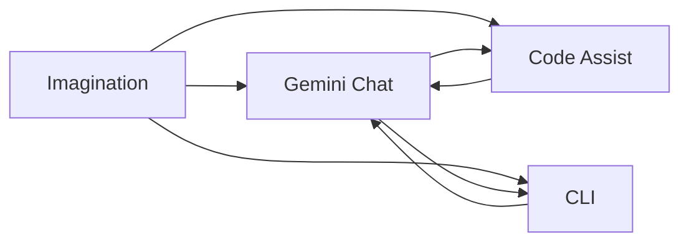
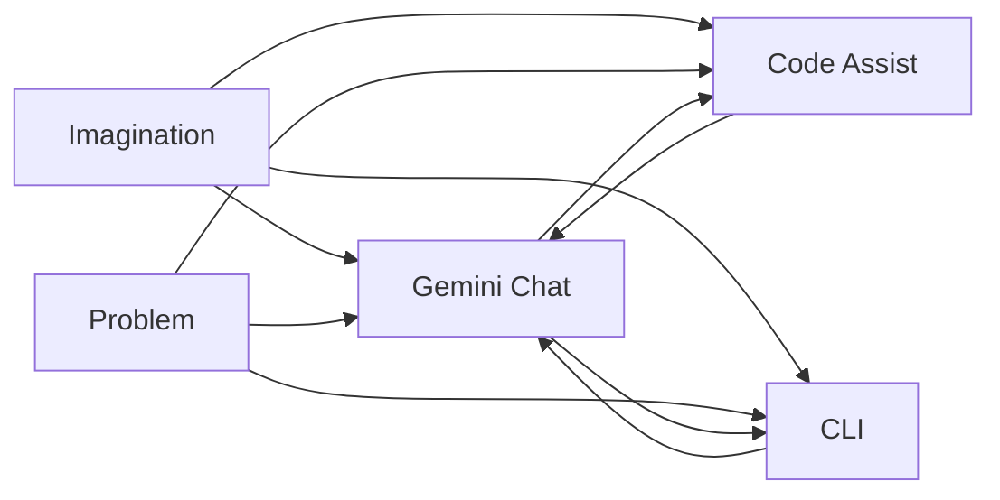

# How *Vibe Coding* Helped Me Turn Imagination Into Reality

<figure>
  
  <figcaption>Where imagination meets execution</figcaption>
</figure>

I'm a former full-time developer, and while I haven't worked in production code for over a decade, I occasionally write micro-scale scripts—automating tasks or crunching data.

But recently, I challenged myself to build something bigger: an **AI-powered portfolio website**. My goal wasn’t just to showcase skills—I wanted to dive into how **RAG (retrieval-augmented generation)** works in a real-world setting.

This time, I wasn't alone. I was **vibe-coding with Gemini**.

## What *Is* “Vibe Coding”?

Coined by AI insiders like Andrej Karpathy, *vibe coding* is the term for a new, AI-assisted development style:

> “You just see stuff, say stuff, run stuff, and copy‑paste stuff—and it mostly works.”

It's less about writing perfect code and more about **flow**. You ideate, prompt the AI, try things out, and keep iterating.

For me, this style of coding was liberating:

* I had a vision
* I wasn't afraid to break things
* And Gemini helped me translate imagination into code

Whether you're exploring an idea or building a prototype at 2AM, *vibe coding* is your creative zone.

### Key Traits of Vibe Coding

* **Prompt-driven** — communicate in natural language
* **Fast-paced** — code-first, refine later
* **Flexible** — ideal for prototypes or side projects
* **Collaborative** — AI is your pair programmer

It’s not a trend. It’s a legit shift in how we write software—especially with tools like Gemini.

## Tools I Used

To bring my idea to life, here’s my stack:

* **[Visual Studio Code](https://code.visualstudio.com/)** – The workspace
* **[Gemini Pro](https://gemini.google.com/)** – Broad context understanding
* **[Gemini Code Assist for Visual Studio Code](https://marketplace.visualstudio.com/items?itemName=Google.geminicodeassist)** – Inline code editing
* **[Gemini CLI](https://github.com/google-gemini/gemini-cli)** – Code generation from terminal commands

These tools let me go from concept to deployment in a tight feedback loop.

## What You Need to Get Started

1. Basic technical understanding
2. A big imagination
3. Patience (lots of it)

> If you lack patience, you’ll need deeper technical knowledge to guide the AI. Otherwise, embrace the chaos and learn as you go.

## My Workflow

### Simple Vibe Coding Flow

A high-level overview of how imagination connects with each Gemini tool:

### Complete Flow

### How to Use These Diagrams

* **Imagination** fuels your prompts.
* **Gemini Chat** helps translate vision into logic.
* **Code Assist** and **CLI** help refine or automate the implementation.
* The flow is flexible—**loop back** anytime.

---

### 1. **Start With a Clear Vision**

My prompt to myself was simple:

> “I want to build an AI-powered portfolio website.”

No Figma. No specs. Just vibes.

### 2. **Plan with Gemini Chat**

**Gemini Chat** is your systems thinker.

* It sees broad architectural patterns
* Helps design file structures
* Understands context and logic deeply

I used it to understand RAG, plan JAMstack flows, and validate my app structure.

### 3. **Refine with Gemini Code Assist & CLI**

Once the big ideas were in place, it was time to sharpen the details.

#### Code Assist

<figure>
  
  <figcaption>Gemini Code Assists in VS Code</figcaption>
</figure>

* Handy for small tasks and UI edits
* Works directly inside VS Code
* Sometimes stalls with long responses

#### CLI

<figure>
  
  <figcaption>Gemini Code CLI in VS Code</figcaption>
</figure>

* Ideal for automating boilerplate
* Best for scaffold-heavy workflows
* Requires CLI knowledge

## Comprehensive Comparison Table

| Feature / Tool               | Gemini Chat                | Code Assist             | Gemini CLI                 |
| ---------------------------- | -------------------------- | ----------------------- | -------------------------- |
| **Best For**           | Planning, Debugging        | Edits & Fixes           | Scaffolding & Automation   |
| **Skill Level**        | Beginner - Intermediate    | Intermediate - Advanced | Advanced / CLI users       |
| **Ease of Use**        | ⭐⭐⭐⭐☆                 | ⭐⭐☆☆☆              | ⭐☆☆☆☆                 |
| **Code Awareness**     | Full context understanding | Single-file only        | Limited, depends on prompt |
| **Code Insertion**     | Manual                     | In-editor               | Terminal automation        |
| **Response Stability** | High                       | Mid (can cut off)       | Mid (can misfire)          |

## Limitations & Frustrations

* Long snippets cut off in Code Assist
* CLI sometimes loses context
* Still requires *good prompting*
* No true multi-file awareness

**AI is powerful, but it still needs you. AI is still a tool—not a replacement.**

## Why AI Won’t Replace Developers (Yet)

Despite the hype, AI coding tools aren’t ready to fully replace human developers.

### Trusted Perspectives

* **AI can’t understand full systems** or adapt to changing business rules without help ([Forbes](https://www.forbes.com/forbestechcouncil/)).
* **GitHub’s CEO** stated AI will  *increase* , not decrease, the need for good engineers ([Business Insider](https://www.businessinsider.com/github-ceo-smartest-companies-hire-more-software-engineers-2025-7)).
* **Real-world dev** requires logic, ethics, debugging, teamwork—things AI can’t do alone ([Built In](https://builtin.com/articles/ai-will-never-replace-software-developers)).

AI helps. But it doesn’t replace *intuition* or *judgment*.

## ✨ Final Thoughts

This wasn’t just about building a website. It was about rediscovering the joy of making. **And I did it vibe-coding with Gemini.**

## 👉 Try It Yourself

Have an idea? Start small. Don’t overthink it. Open Gemini and prompt it. When you vibe with your tools, amazing things happen.

Or just chat with **[Nait](https://bychris.me)**
